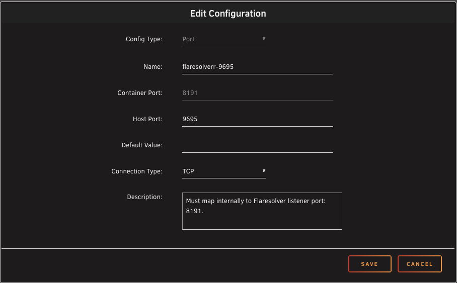

# The Ultimate Book & Audiobook Automation Guide

**Featuring: Shelfmark, Prowlarr, FlareSolverr (via Gluetun), Calibre-Web-Automated, & Audiobookshelf**

---

### 1. The "Data Backbone" (Folder Structure)

Set up the following folders via the unraid share interface to allow seamless file handoffs.

- `/mnt/user/downloads/books`: Where Shelfmark/Prowlarr sends new downloads.
- `/mnt/user/data/media/ebooks`: The permanent Calibre library.
- `/mnt/user/data/media/audiobooks`: The permanent Audiobookshelf library.

---

### 2. The VPN & Proxy Shield (Gluetun + FlareSolverr)

To bypass Cloudflare blocks (like on 1337x or EZTV), we route FlareSolverr through your VPN.

1.  **GluetunVPN Config**: \
    Add a new Port Mapping: `Host: 9695` / `Container: 8191` (TCP).
    

        
screenshot

    

      

1.  **FlareSolverr Config**:
    - _Network Type_: `Container`
    - _Container Network_: `GluetunVPN`
    - Delete the port configuration as we are using Gluetun to do the work.
1.  **Prowlarr Proxy Setup**:
    - Go to _Settings_ -> _Indexers_ -> _Add Proxy_ -> _FlareSolverr_
    - _Host_: `http://172.17.0.1:8191` (The Docker Bridge IP)
    - _Timeout_: Set to **60 or 120 seconds** (Crucial!)
    - _Tag_: `flaresolverr`
1.  **Indexer Link**: Add the `flaresolverr` tag to any indexers that complain about Flaresolverr.

---

### 3. Shelfmark (The "Request" Front-End)

- _App_: Search `Shelfmark` in Community Applications.
- _Paths_: `/books` -> `/mnt/user/data/downloads/books`.
- _Setup_:
  - _Search Mode_: Change to _Universal_.
  - _Prowlarr API_: Link your Prowlarr URL and API Key.
  - _Metadata_: Use _Hardcover_ (Account setup for API Key in LastPass).
  - _Download Client_: Link your qBittorrent/SABnzbd instance.

---

### 4. Calibre-Web-Automated (The "Librarian")

This version automatically "ingests" and converts files.

- _App_: Search `Calibre-Web-Automated`.
- _Paths_:
  - `/books` -> `/mnt/user/data/media/ebooks`
  - _`/ingest` -_> `/mnt/user/data/downloads/books` (Matches Shelfmark).
- _Automation_: In the _Admin Panel_, enable _Automatic Ingest_. When a book finishes downloading, it will be moved and added to your library instantly.

---

### 5. Audiobookshelf (The "Player")

- _App_: Search `Audiobookshelf`.
- _Paths_: `/audiobooks` -> `/mnt/user/data/media/audiobooks`.
- _Setup_: Add a "Books" library pointing to `/audiobooks`. Use the mobile app (_via Tailscale_) for streaming on the go.

---

### How the Magic Happens:

1.  _Request_: You search for a book in _Shelfmark_ via Tailscale on your phone.
2.  _Search_: Shelfmark asks _Prowlarr_ to find it; Prowlarr uses _FlareSolverr_ to sneak past Cloudflare.
3.  _Download_: The torrent is sent to your client and lands in `/downloads/books`.
4.  _Process_: _Calibre-Web-Automated_ sees the file, converts it to EPUB, and moves it to your permanent collection.
5.  _Enjoy_: You open the _Audiobookshelf_ or _Calibre-Web_ UI and start reading/listening.
