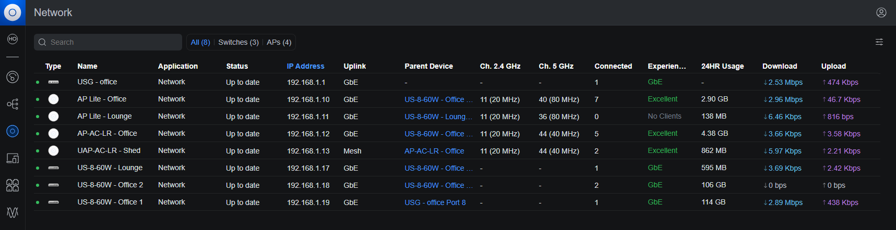
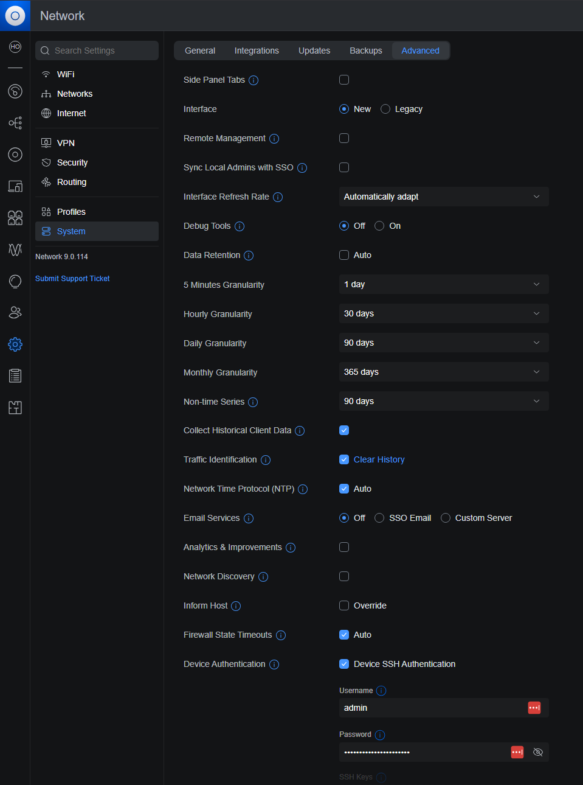

Most of the networking/infrastructure we have at home are Ubiquiti Unifi devices.

The [controller software](https://ui.com/us/en) is set up as a docker container on MUTHUR and can be accessed via:

- Login details (LastPass): `Unifi (8443)`
- Local access: https://muthur.local:8443/manage/default/dashboard
- VPN access: https://muthur.burmese-ghoul.ts.net:8443/manage/default/dashboard

## Network Configuration

The Unifi ecosystem is a bit of a pro-sumer purchase, but very nice to work with. We are probably going to stick with it for some time.

The controller software gives you some good insights and overview of how things are configured.

Some quick links:

- [Topology](https://muthur.local:8443/manage/default/topology): This shows essentially a map of everything that is currently on our network and how they link to each other via the network switches that are also Unifi.
- [System updates](https://muthur.local:8443/manage/default/settings/system/updates): Go here for (firm/soft)ware updates.
- [Unifi devices](https://muthur.local:8443/manage/default/devices): here you can see the state of the unifi devices (infrastructure) on the network; their usage and other useful information.
- [Client devices](https://muthur.local:8443/manage/default/clients/all): All of the devices that are connected to our network.

### Static IP address assignments

I am terrible at ensuring this is kept up to date, but the ideas are here and they are implemented for the most part. Thnere will likely be a lot of devices that haven't been classified yet and are appearing in the "guest" IP range.

We are build on a `192.168.X.X` IP range.

I have reserved certain ranges for specific devices that we own. The idea here is that i could apply specific rules, if necessary to control the functionality available. Also just so I can track what the hell is going on.

| Range                         | Description                                   |
| ----------------------------- | --------------------------------------------- |
| `192.168.1.1X`                | Unifi devices (infrastructure)                |
| `192.168.1.2X`                | Home devices like lights or vacuums           |
| `192.168.1.3X`                | Home devices for entertainment (speakers etc) |
| `192.168.1.4X`                | Wired computers                               |
| `192.168.1.5X`                | Wireless computer adapters and laptops        |
| `192.168.1.6X`                | **UNUSED**                                    |
| `192.168.1.7X`                | Mobile phones and watches                     |
| `192.168.1.8X`                | iPads and tablets                             |
| `192.168.1.9X`                | Servers MUTHUR etc                            |
| `192.168.1.100-192.168.1.255` | Guest devices                                 |

### Updating firmware of devices

I have the controller software set up to automatically apply firmware updates to the devices on a weekly basis.

Firmware is cached before applying updates. I have found that if it isn't there can be issues during upgrading the firmware.

You can also check the current state of the firmware for the network devices in the devices menu.

<details>
  <summary>Click to expand screenshot</summary>



</details>

If you do have to update the firmware for a device folllow the steps below:

- Navigate to [System updates](https://muthur.local:8443/manage/default/settings/system/updates) and enbsure the firmware in question is cached
- Once cached, navigate to [Unifi devices](https://muthur.local:8443/manage/default/devices)
- Find the device you want to update and click it to display the side bar
- In the tabs at the top of the side bar, click the "Settings" tab
- find "Manual Firmware Update" option and follow the steps

## Migration Of the Controller Software

I initially had the controller software running on Frankenmonkey as a service and when setting up MUTHER I had to figure out a way to get things migrated. Luckily it was a pretty simple process that I went through. Instructions provided helpfully by ChatGPT... for the most part they were accurate.

### UniFi Controller Migration Plan (to Docker with New IP)

This guide outlines the steps taken to migrate the UniFi Network Controller from a Windows 10 machine (`192.168.1.42`) to an Unraid-hosted Docker container (`192.168.1.99`) using the [linuxserver/unifi-network-application](https://github.com/linuxserver/docker-unifi-network-application) image.

#### 🧭 Refined Migration Plan (with New IP)

##### 1. Backup the Old Controller

- Open UniFi Network Controller on the source machine.
- Ensure that all devices are running the latest firmware.
- Ensure that you have updated to the latest controller version.
- Go to **Settings → System → Backup**.
- Create a **manual backup** and download the `.unf` file.

##### 2. Deploy the New Controller (Docker on Unraid)

- Use the `linuxserver/unifi-network-application` image.
- Set the Docker container to use a **custom network type (Host)**.
- Assign it a static IP (e.g., `192.168.1.99`).
- Set the appropriate volume paths for persistent data.

##### 3. Import the Backup

- Access the new controller via `https://muthur.local:8443`.
- In the welcome screen there is a ling to "Restore from backup". Do that.
- Upload the `.unf` backup file.
- The controller will restart after restoring the configuration.

##### 4. Confirm Controller Access

- Log into the new controller UI using the last pass entry details
- Go to **Devices** to see that all of the infrastructure is displayed.
- Most should appear as `Up to date`; some may show `Adopting`.
- When migrating to MUTHUR it automatically went through the adoption process for each of the devices, they appeared as "Adopting" then refreshed to "Up to date"

##### 5. SSH into Devices to Check Inform Address

I did this just to confirm that things were set up on the device correctly. I only checked one of them to have a pretty good idea that they were updated correctly.

- SSH into each UniFi device using the credentials found in the controller software by navigating to: "Settings > System" then in the page tabs, click "Advanced" and look for the section labelled "Device Authentication". That has the username and password (which you can copy) to perform the SSH access below.
  <details>
    <summary>Click to expand screenshot</summary>
    
  </details>

```bash
ssh admin@<device_ip>
```

- Run the following:
  ```
  mca-cli
  info
  ```
- You will get output like that below, which was pulled from one of the WAPs we have. The **Status** field is where the device believes the controller is running. As long as it points to the new controller location we are gold.

  ```
  AP-AC-LR-Office-BZ.6.6.77# mca-cli
  UniFi# info

  Model:       UAP-AC-LR
  Version:     6.6.77.15402
  MAC Address: 18:e8:29:fd:43:36
  IP Address:  192.168.1.12
  Hostname:    AP-AC-LR-Office
  Uptime:      5419592 seconds
  NTP:         Synchronized

  Status:      Connected (http://192.168.1.99:8080/inform)
  ```

##### 6. Update the inform-address (optional)

This is only necessary if the status above is pointing to the wrong place. The assumption is that you have already SSH-ed into the target device

- Load the devices screen

      <details>

  <summary>Click to expand screenshot</summary>

  

      </details>

- Run the following command setting the IP address to the new controller IP.
  ```
  set-inform http://192.168.1.99:8080/inform
  ```
- Keep an eye on the "Status" column in the devices interface and watch it dance.
