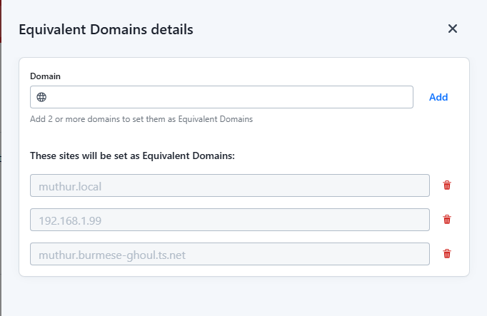
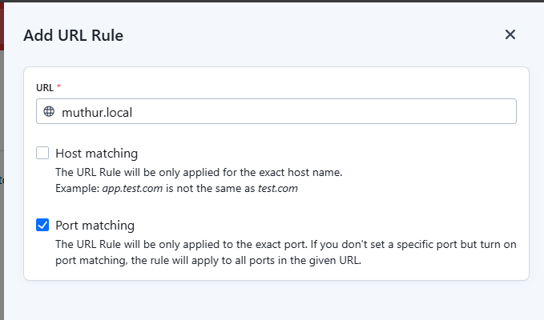

import { Badge } from "@astrojs/starlight/components";

## LastPass

I have set up everything as I go into [LastPass](https://lastpass.com/vault/).
Mother knows my master password in case you do need to get access to any of this stuff, but this page will hopefully get you set up and running without the need to do that.

### Initial Setup

All logins have been placed under a shared folder in Last Pass. The folder name is "MUTHUR - apps" and an invitation has been sent to the family members so they can get access.

I will continue to add relevant logins to that folder in order to access the various services we have set up. Generally these will be for administrative purposes.

I plan on having different people have their own logins for various tools so that I can manage it in a better way.

#### Set up LastPass to match shared items

We have a few different ways that the services can be accessed on MUTHUR:

- **IP address**: `http(s)://192.168.1.99`
- **Domain name**: `http(s)://muthur.local`
- **Tailscale VPN**: `http://muthur.burmese-ghoul.ts.net/login` - you will need to be connected to the VPN in order for these to work

I wanted to ensure that no matter which URL you are hitting you can still get the auto-population of elements happening. Now the steps I have followed are in my LastPass account so they may not have worked when you are accessing them via the shared folder.

Never fear, you can also follow the same steps I did and have it work for you too. There are a couple of things to set up:

- Equivalent domains for the urls above
- URL Rules to ensure that it takes the port into consideration.

IF you have no idea what I am talking about here, have a read of the [MDN Web Docs on URL structure](https://developer.mozilla.org/en-US/docs/Learn_web_development/Howto/Web_mechanics/What_is_a_URL)

##### Equivalent domain Setup

- In your [last pass vault](https://lastpass.com/vault/) click on "Advanced Options > Autofill Settings"
- Click on the "Equivalent Domains" tab and click "Add new"
- add an entry for each of the urls below:
  - `muthur.local`
  - `192.168.1.99`
  - `muthur.burmese-ghoul.ts.net`
- click "Save"

##### URL Rules setup

- In your [last pass vault](https://lastpass.com/vault/) click on "Advanced Options > Autofill Settings"
- Click on the "URL Rules" tab and click "Add new"
- Fill out the form as shown below:
  - URL: `muthur.local`
  - Host matching: unchecked
  - Port matching: check this option
- click "Save"

## Gluetun VPN

<Badge text="todo" variant="tip" />

## Tailscale

[Tailscale](https://tailscale.com/) is how we are controlling access to our home network services.

From their site:

> Tailscale makes creating software-defined networks easy: securely connecting users, services, and devices.

- [Support docs](https://tailscale.com/contact/support)

## General setup

- [tailnet](https://tailscale.com/kb/1136/tailnet) has been configured under my Google account.
- [Magic-DNS](https://tailscale.com/kb/1081/magicdns) name burmese-ghoul.ts.net

## SSL access

SSL Certificates have also been set up for MU/TH/UR.

I followed the guide in the following space-invader one video. It was pretty straightforward and the link takes you directly to the relevant part of the video covering setup in Tailscale.

It shouldn't require any more setup and you can access (when connected to the tailnet) muthur via https://muthur.burmese-ghoul.ts.net

